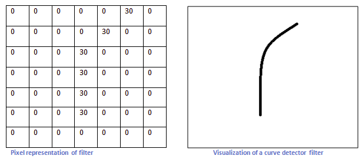
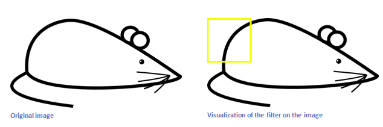
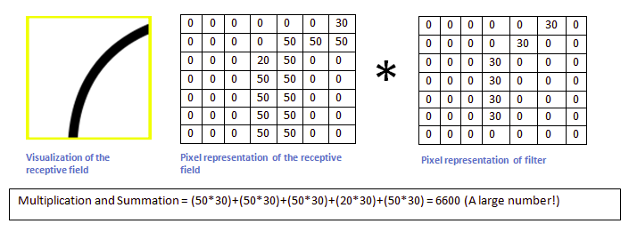
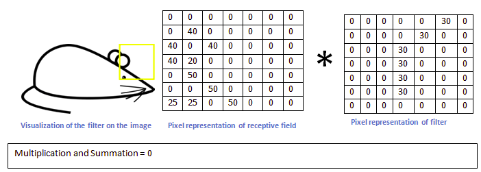
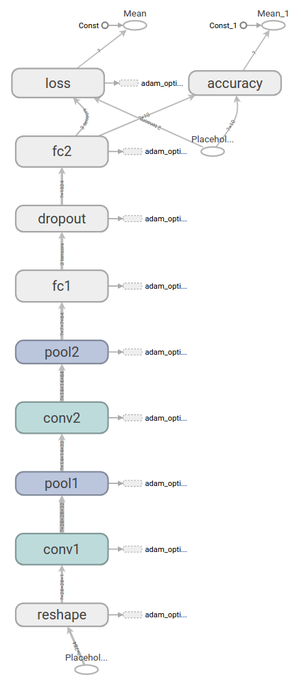

# Convolutional Neural Network

In my opinion, a **convolutional neural network** (**CNN**, or **ConvNet**) is a variation of **BackPropagation Network** (**BPNet**). In this document, I will try to illustrate my understanding of *CNN*, including  the difference or say addition of *CNN* to *BPNet*, how *CNN* works to "understand" image, and my implementation. Also, I did some experiments to optimize my CNN and will you their results.

<!-- START doctoc -->  
<!-- END doctoc -->

## Principle

### Why CNN?

#### Efficiency

Using *BPNet* to classify images, we can easily see a **exponential burst** of *weights*. Because a N\*N \- pixel image needs N\*N inputs (if it is grayscale, it would be 3\*N\*N for an RGB image and 4\*N\*N for an RGBA image), then the weights of the first hidden layer would be N\*N\*X, X is the number of units on the first hidden layer, since BPNet is fully-connected.   

It is still alright for our lab, since our images are only 28\*28 grayscale and the dataset is rather small. However, it is not adviseable to process 1024\*968 RGB images with that, which is a more common case. 

#### Accuracy

Also, the accuracy of *BPNet* on image processing is not good enough (only around **85%** in my previous lab) since the one\-dimensional input of an image sacrifice its two\-dimensional structure. In another word, the **spacial characteristic** of an image is lost. Intuitively, it is hard for human eyes to recognize an image if the image is flattened into a line. 

The input of *CNN* still maintains the structure of a raw image including its color channel. And the *depth* of *filters* is even able to reveal more topological characteristics. Without any optimization, my first experiment can easily achieves an accuracy of over **96%** on 5\-fold cross validation dataset.

### How CNN works \- Demystify the principle of CNN

From a computer's perspective, every image is an arrangement of dots (a pixel) arranged in a special order. 

In order to detect a specific image, a filter (also an image can be represented as a matrix, just relatively much smaller) is used to identify a characteristic of the image. By sliding the filter on the image, the characteristic will be matched through convolution \- dot multiplication and summation of matrices of  corresponding region and filter.  

When the filter is slided onto the "right" place where characteristic is matched, the value of the convolution is large. While the filter is on a region where the characteristic can be hardly matched, the value will be small and close to 0.

After the filter convolves the whole image, an activation image is attained. And the large-value region is just where the characteristic is matched. 

The idea is originated from biological processes in which individual cortical neurons respond to stimuli only in a restricted region of the visual field known as the receptive field. The receptive fields of different neurons partially overlap such that they cover the entire visual field.

Therefore, based on several filters identifying different characteristics, an image can be detected. 

*CNN* based on *BPNet* can automatically learn proper filters to identify patterns of specific images. Thus, usually the filters are not as human-understandable as in the above illustration. And in practice, there are at least two layers of filters. The filters on the first layer aim to identify the boundaries(lines) and then the second layer aims to identify the compositions of boundaries because a filter has depth to go through several previous layers. The more convolutional layers are, the more complicated pattern can be identified.

The output of convolutional layer contains the information that most dedicates to the classification of the image. Thus from another perspective, the convolution layer aims to  extract hidden patterns and input the extracted information to *BPNet* for classification regression. 

## Implemantation
My implementation starts from the example on *Tensorflow*. 

~~~python
def deepnn(x):
    with tf.name_scope('reshape'):
        x_image = tf.reshape(x, [-1, 28, 28, 1])

    # First convolutional layer - maps one grayscale image to 32 feature maps, i.e. 32 filters.
    with tf.name_scope('conv1'):
        W_conv1 = weight_variable([5, 5, 1, 32]) 
        b_conv1 = bias_variable([32])
        h_conv1 = tf.nn.relu(conv2d(x_image, W_conv1) + b_conv1)

    # Pooling layer - downsamples by 2X.
    with tf.name_scope('pool1'):
        h_pool1 = max_pool_2x2(h_conv1)

    # Second convolutional layer -- maps 32 feature maps to 64. A filter go through all previous 32 feature maps and there are 64 filters in total.
    with tf.name_scope('conv2'):
        W_conv2 = weight_variable([5, 5, 32, 64])
        b_conv2 = bias_variable([64])
        h_conv2 = tf.nn.relu(conv2d(h_pool1, W_conv2) + b_conv2)

    # Second pooling layer.
    with tf.name_scope('pool2'):
        h_pool2 = max_pool_2x2(h_conv2)

    # Fully connected layer 1 -- after 2 round of downsampling, our 28x28 image
    # is down to 7x7x64 feature maps -- maps this to 1024 features.
    with tf.name_scope('fc1'):
        W_fc1 = weight_variable([7 * 7 * 64, 1024])
        b_fc1 = bias_variable([1024])

        h_pool2_flat = tf.reshape(h_pool2, [-1, 7 * 7 * 64])
        h_fc1 = tf.nn.relu(tf.matmul(h_pool2_flat, W_fc1) + b_fc1)  # TODO: ReLU

    # Dropout - controls the complexity of the model, prevents co-adaptation of features.
    with tf.name_scope('dropout'):
        keep_prob = tf.placeholder(tf.float32)
        h_fc1_drop = tf.nn.dropout(h_fc1, keep_prob)

    # Map the 1024 features to 14 classes, one for each Chinese character
    with tf.name_scope('fc2'):
        W_fc2 = weight_variable([1024, 14])  # TODO: output size
        b_fc2 = bias_variable([14])

        y_conv = tf.matmul(h_fc1_drop, W_fc2) + b_fc2
    return y_conv, keep_prob

~~~

There are two convolutional layers with 32 and 64 filters respectively. And the second convolutional layer goes through all the 32 feature maps generated from the first layer. For the sake of efficiency, there is a pooling layer after each convolutional layer. Then the reduced input are dumped into BPNet with a dropout layer between two fully connected layers.

As proposed in the example codes, a much more complex AdamOptimizer is used instead of Gradient Descent.

This model achieves an average accuracy of **0.9695848** based on 5-fold cross validation.

N^th fold  | Accuracy of Training set | Accuracy of Test set
------------- | ------------- | -------------
1  | 1 | 0.979079
2  | 1 | 0.983264
3  | 1 | 0.95537
4  | 1 | 0.969317
5  | 1 | 0.960894

step 0, training accuracy 0.161144
step 25, training accuracy 0.983955
step 50, training accuracy 0.999651
step 75, training accuracy 1
test accuracy 0.979079

step 0, training accuracy 0.105337
step 25, training accuracy 0.985351
step 50, training accuracy 0.999651
step 75, training accuracy 1
test accuracy 0.983264

step 0, training accuracy 0.118242
step 25, training accuracy 0.988141
step 50, training accuracy 1
test accuracy 0.95537

step 0, training accuracy 0.129055
step 25, training accuracy 0.993024
step 50, training accuracy 1
test accuracy 0.969317

step 0, training accuracy 0.152371
step 25, training accuracy 0.985356
step 50, training accuracy 0.999651
step 75, training accuracy 1
test accuracy 0.960894

$\color{red}{增加第三层卷积层}$

~~~
step 0, training accuracy 0.123823
step 25, training accuracy 0.987443
step 50, training accuracy 1
test accuracy 0.934449

step 0, training accuracy 0.0927799
step 25, training accuracy 0.980816
step 50, training accuracy 1
test accuracy 0.958159

step 0, training accuracy 0.103593
step 25, training accuracy 0.986746
step 50, training accuracy 1
test accuracy 0.956764

step 0, training accuracy 0.168818
step 25, training accuracy 0.986397
step 50, training accuracy 1
test accuracy 0.945607

step 0, training accuracy 0.150279
step 25, training accuracy 0.988842
step 50, training accuracy 1
test accuracy 0.953911
~~~

$\color{red}{卷积核从5*5改为3*3}$

~~~
step 0, training accuracy 0.122776
step 25, training accuracy 0.981514
step 50, training accuracy 0.997558
step 75, training accuracy 1
test accuracy 0.97629

step 0, training accuracy 0.193582
step 25, training accuracy 0.976979
step 50, training accuracy 0.996861
step 75, training accuracy 0.999302
step 100, training accuracy 1
test accuracy 0.990237

step 0, training accuracy 0.138821
step 25, training accuracy 0.985002
step 50, training accuracy 0.998954
step 75, training accuracy 1
test accuracy 0.967922

step 0, training accuracy 0.208929
step 25, training accuracy 0.976979
step 50, training accuracy 0.996861
step 75, training accuracy 0.999302
step 100, training accuracy 1
test accuracy 0.987448

step 0, training accuracy 0.125523
step 25, training accuracy 0.97106
step 50, training accuracy 0.996513
step 75, training accuracy 1
test accuracy 0.98324
~~~

## Optimization

### Data Augmentation

#### Crop

26*26 左上、左下、右上、右下

#### Gaussian Blur

OpenCV

### Batch Normalization

input of each layer: mean, std   then input = (input-mean)/std
already implemented in TF
 

### Dense Prediction

conv(3\*3, padding=1, stride=1) - BN - ReLU - Pool -> 
conv(3\*3, padding=0, stride=2) - BN - ReLU ->
conv(3\*3, padding=0, stride=2) - BN - ReLU (more conv???)-> avg Pool -> BP

error on training set without mini-batch:
step 0, training accuracy 0.0454799
step 100, training accuracy 0.933873
step 200, training accuracy 0.992467
step 300, training accuracy 0.999442
step 400, training accuracy 1

mini-batch: 256
step 0, training accuracy 0.046875
step 0, training accuracy 0.078125
step 0, training accuracy 0.0664062
step 0, training accuracy 0.113281
step 0, training accuracy 0.0742188
step 0, training accuracy 0.0585938
step 0, training accuracy 0.078125
step 0, training accuracy 0.0976562
step 0, training accuracy 0.113281
step 0, training accuracy 0.144531
step 0, training accuracy 0.136719
step 0, training accuracy 0.0980392
step 25, training accuracy 0.988281
step 25, training accuracy 0.984375
step 25, training accuracy 0.980469
step 25, training accuracy 0.980469
step 25, training accuracy 0.992188
step 25, training accuracy 0.96875
step 25, training accuracy 0.976562
step 25, training accuracy 0.984375
step 25, training accuracy 0.96875
step 25, training accuracy 0.984375
step 25, training accuracy 0.988281
step 25, training accuracy 1

0.9695848