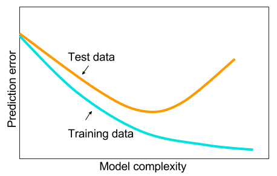
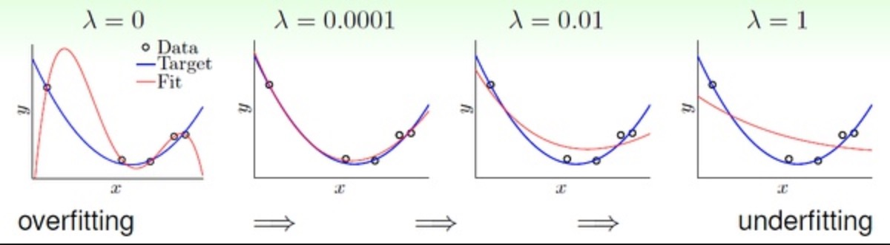

<!-- START doctoc generated TOC please keep comment here to allow auto update -->
<!-- DON'T EDIT THIS SECTION, INSTEAD RE-RUN doctoc TO UPDATE -->
**Table of Contents**  *generated with [DocToc](https://github.com/thlorenz/doctoc)*

- [BackPropagration Network](#backpropagration-network)
  - [<a name="principle">Principle</a>](#a-nameprincipleprinciplea)
    - [Forward](#forward)
    - [Backward](#backward)
      - [Regression](#regression)
      - [Classification](#classification)
  - [Implementation](#implementation)
    - [Preprocess of training data](#preprocess-of-training-data)
      - [Bias](#bias)
      - [Scale of output and input](#scale-of-output-and-input)
    - [Initialization of weight](#initialization-of-weight)
    - [Implementation of an epoch](#implementation-of-an-epoch)
    - [Optimization](#optimization)
      - [Learning rate decay](#learning-rate-decay)
      - [Regularization (Cross Validation)](#regularization-cross-validation)
      - [Stochastic gradient descent](#stochastic-gradient-descent)
      - [Momentum](#momentum)
  - [Evaluation](#evaluation)
    - [Regression of sin(x)](#regression-of-sinx)
    - [Classification of Chinese characters](#classification-of-chinese-characters)
    - [Regularization](#regularization)
    - [SGD + Momentum](#sgd--momentum)
    - [Test my model](#test-my-model)
  - [Configuration](#configuration)

<!-- END doctoc generated TOC please keep comment here to allow auto update -->

# BackPropagration Network
## <a name="principle">Principle</a>
### Forward
  
Each unit (or say, neuron) of the input layer contributes  to its next neuron, i.e. each unit of next layer (output layer), to some extent. The extents (weights) of the contributions are independent. Thus the connection between input layer and output layer is fully connected and single directed.  

Take the basic demo BP network in the above picture as an example to illustrate:  
1. the input is composed of 2 units  $X = [x_{1},   x_{2}]$  
2. and the output has 2 units as well  $Y = [A, B]$   
3. then the weights should be a 2 $\times$ 2 matrix $\theta$ = [$w_{1A}$ $x_{1B}$; $w_{2A}$ $x_{2B}$]  
4. fully-connected contribution means $Y =$ $\theta^T$$X$, i.e. $A =$ $w_{1A}$$x_{1}$ + $w_{2A}$$x_{2}$, $B =$ $w_{1B}$$x_{1}$ + $w_{2B}$$x_{2}$.  
5. $Y$ need post-process to be actuall output: $Y = f(X)$. $f$ is an activation function, which can be *sigmoid, tanH, ReLu, softmax* and other **non-linear** functions.  

The last procedure is necessary to build a complicated network with the ability of self learning. If the function is linear or there is no such a function, the output is just a linear expression of input. Then the deviation of the error on weights are constant, leading to disability of self adjustment of weights to minimize its error. Refer to biological nerual network in human brain, the activation function is what it is called. A neuron is only actived when its shreshold is achieved.  
  
In practice, we actually add a bias unit in the input to better fit a AI model. For convenience, I treat bias as $x_{0}$ and set $x_{0}$ = 1, then let its weight $w_{0x}$ to modify the actual value as bias of the input layer.  

For a multi-layer network, the output $Y$ will be input of next layer. The number of layers can be any positive integer.  
  

### Backward  
By calculating the error and formatting it, the error of each unit can be derived. Then take advantage of *Gradient Descent*, the weights will be adjusted to achieve optimal network step by step, or technically say epoch by epoch.  

Since the error is calculated first on the last layer and then second layer and then gradually until the second layer (the first layer is just input, so calculating its error does not make sense), the process is called backward propagation of errors. That is why BP network is so named.  

  

Represent the process of an epoch in Math goes like this:  
1. Calculate the value at the last layer $\frac {\partial Error}{\partial O^{(L)} }$， $L$ is the number of layers and $O$ is the output of a single unit at a layer. The value and format depends on different problems and will be discussed in details later.  
2. Then goes to previous layer:$$\frac{\partial Error}{\partial O^{(L-1)}}=\frac{\partial Error}{\partial O^{(L)}}\frac{\partial O^{(L)}}{\partial O^{(L-1)}}$$ Because $$O^{(L)} = f(g), g = \sum w^{(L-1)} O^{(L-1)}$$ $$\frac{\partial O^{(L)}}{\partial O^{(L-1)}} = \frac{\partial f(\sum w^{(L-1)} O^{(L-1)})}{\partial O^{(L-1)}} = f^{\prime}(g)* \sum w^{(L-1)}$$Thus$$\frac{\partial Error}{\partial O^{(L-1)}}=\frac{\partial Error}{\partial O^{(L)}}*f^{\prime}(g)* \sum w^{(L-1)}$$$f^{\prime}(g)$ is the deviation of activation function and varies.   
3. Define $$\delta^{(l)}=\frac{\partial Error}{\partial O^{(l)}}*f^{\prime}(g)$$Then the chain rule can be presented as:$$\delta^{(l)}=\delta^{(l+1)}f^{\prime}(g)\sum w^{(l)}, l=2,3,...,L-1$$
4. Adjust weights:$$\Delta w_{ji}^{(l)}=\alpha*\frac{\partial Error}{\partial w_{ji}^{(l)}}$$$\alpha$ is the learning rate. And $$\frac{\partial Error}{\partial w_{ji}^{(l)}}=\frac{\partial Error}{\partial O_{i}^{(l+1)}}\frac{\partial O_{i}^{(l+1)}}{\partial w_{ji}^{(l)}}$$ $$\frac{\partial O_{i}^{(l+1)}}{\partial w_{ji}^{(l)}} = \frac{\partial f(\sum w_{i}^{(l)} O_{i}^{(l)})}{\partial w_{ji}^{(l)}} = f^{\prime}(g)*O_{i}^{(l)}$$ Thus, $$\Delta w_{ji}^{(l)}=\alpha*\frac{\partial Error}{\partial O_{i}^{(l+1)}}*f^{\prime}(g)*O_{i}^{(l)}=\alpha\delta^{(l)}O_{i}$$ In practice, we often adjust weights layer by layer once the needed $\delta$ is derived. And since $\delta$ is derived from last layer to second layer, the asjustment of weights starts from the last second layer to the first layer - **backward propagation**. And the number of epochs should be large enough to achieve little errors.

#### Regression
In regression problems, the error or cost of the final output is square mean: (m is the number of samples)
$$
Error = \frac{1}{2}\sum_{i=1}^{m}(d-O)^2
$$
$m$ is the number of samples, $d$ is the should-be value, $O$ is the predicted value, i.e. the output of last layer. 
 
Then its partial derivative with respect to the outputs: 
$$
\frac{\partial Error}{\partial O} = \frac{\partial \frac{1}{2}\sum_{i=1}^{m}(d-O)^2}{\partial O} = \frac{1}{2}\sum_{i=1}^{m}\frac{\partial (d-O)^2}{\partial O} = \sum_{i=1}^{m}(O - d)
$$  
And $$\delta^{(L)}=\sum_{i=1}^{m}(O - d)*f^{\prime}(g)$$  

#### Classification  
In classification problems, the error or cost of the final output is cross entropy:$$Error=-\sum_{i=1}^{m}[d*lnO+(1-d)*ln(1-O)]$$ Both $d$ and $O$ can only be 0 or 1.  
Thus,
$$\frac{\partial Error}{\partial O}=\frac{O-d}{O(1-O)}$$
Because the activation function of classification problem can only be *sigmoid* or *softmax*, of which the deviation is $f^{\prime}(g)=f(g)*[1-f(g)]$.  
Thus, $$\delta^{(L)}=\sum_{i=1}^{m}(O - d)$$   

## Implementation
Based on *Python 3.6*, making full use of *numpy* for efficient matrix operation.  

### Preprocess of training data

$X$ represents the input of training data and $Y$ the actual value of training data. Both $X$ and $Y$ are matrix, of which each row represent a sample and is composed of features.

#### Bias
As mentioned in the [Principle](#principle) section, I treat bias as a part of the input, thus set its value as 1. Then the bias unit will also dedicated to the output with a certain weight, which will be modified according to the cost.  
In my practice, I thus insert a new feature into all input layers.  

~~~python
def add_bias(X):
    return np.insert(X, obj=[0], values=[1], axis=1)
~~~

#### Scale of output and input
Since there is still an activation function in the last layer which produce the predicted output and the output of activation function is within a certain range, $Y$ is supposed to be scaled in the same range as predicted output, say $Y'$.  

$$
Y = Y'_{min}+(Y-Y_{min})* \frac{Y'_{max}-Y'_{min}}{Y_{max}-Y_{min}}
$$

Cautious: $Y'_{max}$ is the value $Y'$ can be instead of actually being. E.g. in sigmoid function, $Y'_{max}=1, Y'_{min}=0$ .

~~~python
def normalize_y(Y):
    return (Y - miny)*(maxa - mina)/(maxy - miny) + mina
~~~

Since in our case, $X$ is within a small range [-3.14, 3.14], it is not necessary to scale $X$.

### Initialization of weight
The initial weights matters a lot and there are two common ways of random initialization.  
1. **Gaussian**: Weights are randomly drawn from Gaussian distributions with fixed mean (e.g. 0) and fixed standard deviation (e.g. 0.01).  
2. **Xavier**: It initializes the weights in network by drawing them from a distribution with zero mean and a specific variance ($n$ is the number of units on a layer):$$var(\Theta)=\frac{2}{n_{in}+n_{out}}$$  

In my implementation, I choose Xavier initialzation. Thus, the codes goes like this:  

~~~python
def random_weight(inputLayerSize, outputLayerSize):
    inputLayerSize += 1  # add bias
    epsilon_init = np.sqrt(6) / np.sqrt(inputLayerSize + outputLayerSize)
    return np.random.uniform(low=-epsilon_init, high=epsilon_init, size=(inputLayerSize, outputLayerSize))
~~~  
It is an effective strategy to randomly select values for $\Theta^{(l)}$ uniformly in the range $[-\epsilon_{init}, \epsilon_{init}]$, $ \epsilon_{init}=\frac{\sqrt6}{\sqrt{n_{in}+n_{out}}}$. However, since the random seed depends on the unit number of input layer and output layer, the weights of each layer should be initialized separately. Thus,  
 
~~~python
def initialize_weight(X, Y):
    Theta = list()
    Theta.append(random_weight(X.shape[1], hidden_units[0]))
    for i in range(len(hidden_units)-1):
        Theta.append(random_weight(hidden_units[i], hidden_units[i+1]))
    Theta.append(random_weight(hidden_units[-1], Y.shape[1]))
    return Theta
~~~  

### Implementation of an epoch
An epoch consists of a forward process and a backward process.

~~~python
# Forward
O = list()  # O is a 3D array to record the outputs of each layer. The first dimension refers to the outputs of a layer, the second refers to a sample data and the first refers to features of a sample.
O.append(mX)  # the first layer is just the input, mX = add_bias(X)
i = 0
for theta in Theta:  # theta is Matrix[n_in, n_out]
    o = activate(O[i].dot(theta))  # output of next layer
    O.append(add_bias(o))  # secretly add bias
    i += 1
O[-1]=remove_bias(O[-1])  # last layer is for output, thus no need for bias
~~~

$O$ is recorded for the backward process.

~~~python
# Backward
step = learning_rate/X.shape[0]  # X.shape[0] is the number of samples
mY = O[-1]  # predicted output is on the last layer
E = Y - mY  # negative
e_top = E * activatePrime(mY)
Theta[-1] += step * O[-2].T.dot(e_top)  # hidden top layer * error top layer
e_pre = e_top
for i in range(1, len(Theta)):
    e = e_pre.dot(Theta[-i].T) * activatePrime(O[-1-i])  # next layer
    e = remove_bias(e)  # remove error of added bias units
    Theta[-1-i] += step * O[-2-i].T.dot(e)
    e_pre = e
~~~

### Optimization

There are several ways to optimize the network to make it achieve better accuracy faster.

####Early stopping  

It is hard to tell how many epochs should the network walk through to achieve the optimal status. Brutally assign a large value is not a wise choice, for different initial weights requires different rounds of epochs. If very fortunately, the initial weights are just somewhere near the minimum cost status, a small number of epochs is enough; otherwise, not large enough number of epochs will only result in half-done status.   
One way to decide when to stop the training of the model is called *Early-stopping*. When cost of the model keeps not going down in at least N epochs, the training should be stopped. And usually the N is 10,30 or 50.

~~~python
# An effective way for early stopping
while 1:
	epoch()
	# calculate cost
	if avg_cost <= min_avg_cost:
	    min_avg_cost = avg_cost
	    i = 0
	else:
	    i += 1
	if i == 30:  # the value can be changed
		break
~~~

#### Learning rate decay

It is obvious that a small learning rate results in slow convergance, while a large one may cause vibration. In order to achieve the minimum cost status in a faster way, a common practice is to initizalize a learning rate at a relatively large value, like 0.5. And combined with early stopping, when it is time to stop, we cut down the learning rate instead. That is callled *Learning rate decay*.  
Finally, when the current learning rate is smaller than 1/1024 initial one, the training is stopped.

~~~python
while 1:
	epoch()
	# calculate cost
	if avg_cost <= min_avg_cost:
	    min_avg_cost = avg_cost
	    i = 0
	else:
	    i += 1
	if i == 30:  # the value can be changed
		learning_rate /= 2
	    i = 0
~~~

#### Regularization (Cross Validation)  
For the regression of `sin` function problem, regularization is unnecessary because there is no separate test set. But for classification problem, the overfit is obvious and may hurt the accuracy of test set.   
Overfit means being too complex for the model to afford, resulting in highly-accurate in matching traing set for it tries to fit each sample data. And usually, it can only achieve limited accuracy on test set of which the data is never seen before.  

When training the model of training set, 100% accuracy can be easily achieved. However, the accuracy of that model on test set is only around 85%. The most common way is *regularization*, which means add cost of weight itself in loss function.
$$OriginalCost+\frac{\lambda}{2m}\sum\Theta^2$$ 
Thus when $w$ is not the weight of bias unit (the weight of bias unit is the actual bias, thus out of the boundary of bias), 
$$\Delta w - \frac{\lambda}{m}w$$
$\Delta w=\frac{\partial Error}{\partial w}$ is the original error derivation, $m$ is the number of samples, $\lambda$ determines the degree of regularization. The larger $\lambda$ is, the model is tend to underfit, otherwise, overfit.   
The reason why larger weights results in overfitting should be deduced based on Bayes probabilities, which is currently beyond my understaning Orz. Let's discuss it later after DDL :)

~~~python
for i in range(len(Theta)):
    # ======= Regularization ========
    forReg = - Theta[-1 - i] * step * reg_lambda
    forReg = np.delete(forReg, obj=[0], axis=0)  # bias should not be regularized
    forReg = np.insert(forReg, obj=[0], values=[0], axis=0)
    Theta[-1 - i] += forReg
    # ======= Regularization ======== before the 
    Theta[-1 - i] += step * O[-2 - i].T.dot(e)        
~~~   

Without experiments, the proper value of $\lambda$ is unknown. Usually, in order to attain good hyper-parameters, a validation set is needed. And since in our case, the whole dataset is small, I choose 5-fold cross validation. 

~~~python
def cross_validation(reg_lambda, fold=5):
    (X, Y) = get_data()
    total = X.shape[0]
    I = np.arange(total)
    random.shuffle(I)  # The ramdom shuffle of original dataset is quite important for a unbiased result. 
    random.shuffle(I)
    random.shuffle(I)
    batchSize = round(total / fold)
    start = 0
    accuracy = list()
    for i in range(fold):
    	 # use I for index to match Y with X
        (X_test, X_train) = generate_batch(X, I, start, start + batchSize)
        (Y_test, Y_train) = generate_batch(Y, I, start, start + batchSize)
        Theta = train_model(reg_lambda, X_train, Y_train)
        accuracy.append(predict(Theta, X_test, Y_test))
        start += batchSize
    avg_accuracy = np.mean(accuracy)
    print('lambda:%f\navg_accuracy:%f' % (reg_lambda, avg_accuracy))
    print('detailed accuracy: ')
    print(accuracy)
    return avg_accuracy
~~~

#### Stochastic gradient descent
In short, SGD is a batched version of gradient descent. The training set is randomly and evenly cut into N batches and only a batch is used in an epoch. First of all, this will definitely result in fast convergance, for the volumn of traing set decrease remarkably. Secondly, because of the randomness of thethis also helps to solve the problem of overfitting.   
In our classification problem, the number of images is small and the size of each image is only 28*28, so the efficiency is not a problem.

#### Momentum

In short, it originates from *inertance* in Physicsm. Thus it aims to make the movement (change) of weights tend to its original path, which is helpful to jump out of a local optimal status.  

$$\Theta^{t+1} = \alpha * \Theta^{t}- \Delta \Theta^{t} + \gamma (\Theta^{t} - \Theta^{t-1})$$
$\alpha$ is step, i.e. learning rate / number of samples, $\gamma$ is momentum strength, which is usually set as 0.5 initially and modified to 0.9 later.

~~~python
# backward process starts
# ======momentum======
momentum = (np.array(Theta) - np.array(pre_Theta)) * momentum_strength
pre_Theta = Theta

# calculate error propagation like before
......
# finally
Theta += momentum
return
~~~

Usually, Momentum is combined with SGD.

## Evaluation  
### Regression of sin(x)
Learning rate decay + early stopping is quite enough for this case. Due to the time limits, the best model I trained achieve the average error of **0.004655**. The model is stored in `regression.model` and you can simply run `predict_optimal()` in `regression.py`.

### Classification of Chinese characters
There is only slight difference with the optimal methods, such as SGD + momentum, regularization. 

### Regularization

~~~python
hidden_units = [100, 80, 50] # array for more layers
activation = ['tanH', 'tanH', 'tanH', 'softmax']
learning_rate = 0.45  # initially
~~~

$\lambda$     | Accuracy of test est
------------- | -------------
0  | 0.85602331252970565
0.01   | 0.8498928652127502
0.02  | 0.85379529853595459
0.04    | 0.85100356077074724
0.08    | 0.85351363144074865
0.16    | 0.84542748728017902
0.32    | 0.85379101314446459
0.64    | 0.85602526043492833
1.28    | 0.85435746398323231
2.56    | 0.85323547057494376
5.12    | 0.84570525856493928
10.24    | 0.85574320375867807
50    | 0.845427097699 
100    | 0.836776061024
150    | 0.765061592763
200    | 0.531511652369

We can easily see for common $\lambda$ values, there is nearly no difference, i.e. 100% accuracy can always be achieved on training set while the accuracy on test set remain the same. Only when the $\lambda$ becomes incredibly large, like larger than 50, both accuracy of training set and test set decrease.  

### SGD + Momentum
No remarkable improvement as well :(  

Parameter     | Value
------------- | -------------
hidden units | [100, 80, 50]
activation  | ['tanH', 'tanH', 'tanH', 'softmax']
initial learning rate | 0.45
lambda | 0
avg accuracy traing CV | 1.0
avg accuracy test CV | 0.854080

### Test my model
Please use `preprocess.py` and main function in `classification.py`

## Configuration
The artificial networks of classification and regression are different, thus they are in separate files. But the parameters of the network are both listed on the top. 

~~~python
# classification.py
minx, maxx = 0, 1  # range of input
miny, maxy = 0, 1  # range of output
learning_rate = 0.45
hidden_units = [100, 80, 50]  # each number represents the number of units of hidden layers
activation = ['tanH', 'tanH', 'tanH', 'softmax']  # activation function of each layer
regularization = [0,0.01,0.02,0.04,0.08,0.16,0.32,0.64,1.28,2.56,5.12,10.24]
max_epoch = 50000
momentum_strength = 0.5
batchSize = 256
~~~

~~~python
# regression.py
ax_error = 1e-2
minx, maxx = -3.14, 3.14
miny, maxy = -1, 1
numx = int(maxx*5+1)
hidden_units = [5,2]
activation = 'sigmoid'
max_epoch = 5000000
momentum_strength = 0.5

def f(x): return np.sin(x)

X = np.linspace(minx, maxx, num=numx)
~~~