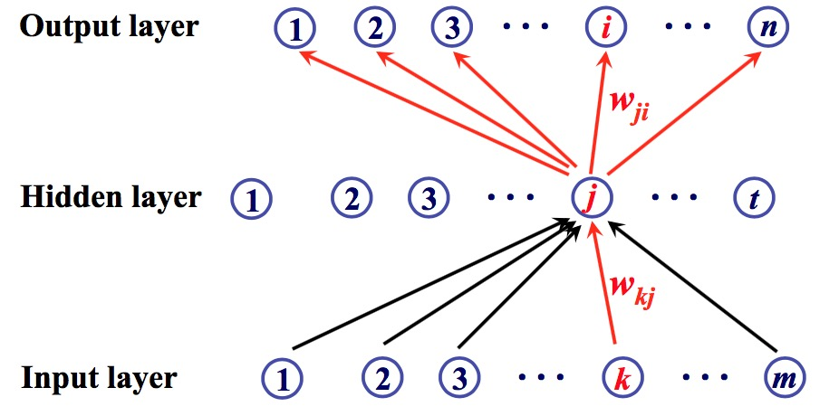

# BackPropagration Network
## Principle
### Forward
  
Each unit (or say, neuron) of the input layer contributes  to its next neuron, i.e. each unit of next layer (output layer), to some extent. The extents (weights) of the contributions are independent. Thus the connection between input layer and output layer is fully connected and single directed.  

Take the basic demo BP network in the above picture as an example to illustrate:  
1. the input is composed of 2 units  $X = [x_{1},   x_{2}]$  
2. and the output has 2 units as well  $Y = [A, B]$   
3. then the weights should be a 2 $\times$ 2 matrix $\theta$ = [$w_{1A}$ $x_{1B}$; $w_{2A}$ $x_{2B}$]  
4. fully-connected contribution means $Y =$ $\theta^T$$X$, i.e. $A =$ $w_{1A}$$x_{1}$ + $w_{2A}$$x_{2}$, $B =$ $w_{1B}$$x_{1}$ + $w_{2B}$$x_{2}$.  
5. $Y$ need post-process to be actuall output: $Y = f(X)$. $f$ is an activation function, which can be *sigmoid, tanH, ReLu, softmax* and other **non-linear** functions.  

The last procedure is necessary to build a complicated network with the ability of self learning. If the function is linear or there is no such a function, the output is just a linear expression of input. Then the deviation of the error on weights are constant, leading to disability of self adjustment of weights to minimize its error. Refer to biological nerual network in human brain, the activation function is what it is called. A neuron is only actived when its shreshold is achieved.  
  
In practice, we actually add a bias unit in the input to better fit a AI model. For convenience, I treat bias as $x_{0}$ and set $x_{0}$ = 1, then let its weight $w_{0x}$ to modify the actual value as bias of the input layer.  

For a multi-layer network, the output $Y$ will be input of next layer. The number of layers can be any positive integer.  
  

### Backward  
By calculating the error and formatting it, the error of each unit can be derived. Then take advantage of *Gradient Descent*, the weights will be adjusted to achieve optimal network step by step, or technically say epoch by epoch.  

Since the error is calculated first on the last layer and then second layer and then gradually until the second layer (the first layer is just input, so calculating its error does not make sense), the process is called backward propagation of errors. That is why BP network is so named.  

Represent the chain rule for partial derivatives of error in Math goes like this:  
1. Calculate the value at the last layer $\frac {\partial Error}{\partial O^{(L)} }$， L is the number of layers.  
2. Then goes to previous layer:$$\frac{\partial Error}{\partial O^{(L-1)}}=\frac{\partial Error}{\partial O^{(L)}}\frac{\partial O^{(L)}}{\partial O^{(L-1)}}$$Because $$O^{(L)} = f(g), g = \sum w^{(L-1)} O^{(L-1)}$$$$\frac{\partial O^{(L)}}{\partial O^{(L-1)}} = \frac{\partial f(\sum w^{(L-1)} O^{(L-1)})}{\partial O^{(L-1)}} = f^{\prime}(g)* \sum w^{(L-1)}$$Thus$$\frac{\partial Error}{\partial O^{(L-1)}}=\frac{\partial Error}{\partial O^{(L)}}*f^{\prime}(g)* \sum w^{(L-1)}$$$f^{\prime}(g)$ is the deviation of activation function and varies.   
3. Define $$\delta^{(l)}=\frac{\partial Error}{\partial O^{(l)}}*f^{\prime}(g)$$Then the chain rule can be presented as:$$\delta^{(l)}=\delta^{(l+1)}f^{\prime}(g)\sum w^{(l)}, l=2,3,...,L-1$$
4. Adjust weights from last second layer to the first layer$$\Delta w_{ji}^{(l)}=\alpha*\frac{\partial Error}{\partial w_{ji}^{(l)}}$$$\alpha$ is the learning rate. And $$\frac{\partial Error}{\partial w_{ji}^{(l)}}=\frac{\partial Error}{\partial O_{i}^{(l+1)}}\frac{\partial O_{i}^{(l+1)}}{\partial w_{ji}^{(l)}}$$ $$\frac{\partial O_{i}^{(l+1)}}{\partial w_{ji}^{(l)}} = \frac{\partial f(\sum w_{i}^{(l)} O_{i}^{(l)})}{\partial w_{ji}^{(l)}} = f^{\prime}(g)*O_{i}^{(l)}$$ Thus, $$\Delta w_{ji}^{(l)}=\alpha*\frac{\partial Error}{\partial O_{i}^{(l+1)}}*f^{\prime}(g)*O_{i}^{(l)}=\alph\delta^{(l)}$$

In regression problems, the error or cost of the final output is square mean: (m is the number of samples)
$$
Error = \frac{1}{2}\sum_{i=1}^{m}(d-O)^2
$$
$m$ is the number of samples, $d$ is the should-be value, $O$ is the predicted value. 
 
Then its partial derivative with respect to the outputs: 
$$
\frac{\partial Error}{\partial O} = \frac{\partial \frac{1}{2}\sum_{i=1}^{m}(d-O)^2}{\partial O} = \frac{1}{2}\sum_{i=1}^{m}\frac{\partial (d-O)^2}{\partial O} = \sum_{i=1}^{m}(O - d)
$$  
There goes the chain rule for partial derivatives of error:  
  
Start from the final layer:
$$
\frac{\partial Error}{\partial w_{ji}} = \frac{\partial Error}{\partial O_i} \frac{\partial O_i}{\partial w_{ji}}
$$  
Because
$$O_i = f(g), g = \sum_{j} w_{ji} O_j$$
$$
\frac{\partial O_i}{\partial w_{ji}} = f^{\prime}(g)*g^{\prime}=f^{\prime}(g)*O_j
$$
Thus
$$\frac{\partial Error}{\partial w_{ji}} = (O-d)*f^{\prime}(g)*O_j$$
$f^{\prime}(g)$ is the deviation of activation function and varies.  

Deep into the middle layer:

$$\frac{\partial Error}{\partial w_{kj}} = \frac{\partial Error}{\partial O_j}\frac{\partial O_j}{\partial w_{kj}}$$
$\frac{\partial O_j}{\partial w_{kj}} = f^{\prime}(g)*g^{\prime}=f^{\prime}(g)*O_k$ can be derived in the same way as $\frac{\partial O_i}{\partial w_{ji}}$.
$$\frac{\partial Error}{\partial O_j}=\frac{\partial Error}{\partial O_i}\frac{\partial O_i}{\partial O_j}$$
It is obvious that the error has its chain rule. The error of previous layer relys on latter one.
$$
\frac{\partial O_i}{\partial O_j} = \frac{\partial f(\sum_j w_{ji} O_j)}{\partial O_j} = f^{\prime}(g)* \sum_j w_{ji} 
$$